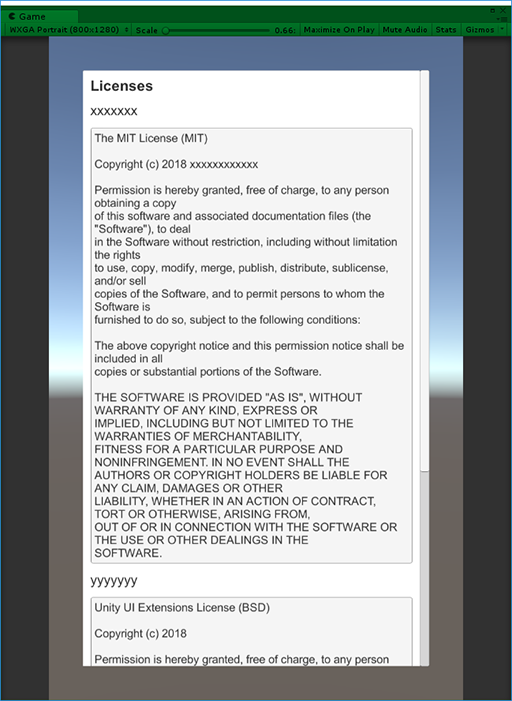
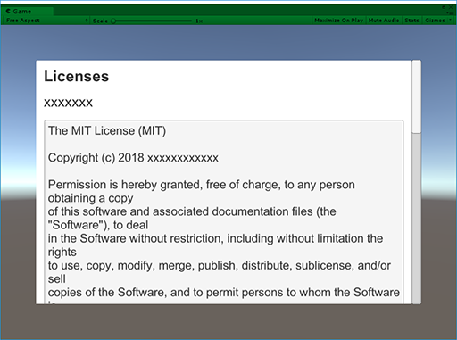

# Easy License View

Easy License View is very very simple License Viewing UI made by uGUI for Unity.

I think everyone can easily make this , but I did not find it in googling. so, I tried making this.

### Features
- Make license text data from excel file. data is Scriptable Object.
- Easy to edit ui view.
- Auto fit to screen.

### Usage
1. Import easylicenseview.unitypackage to your project.
1. Modify the license.xlsx according to your project, and save. license.asset is modified automatic. It is placed under `Assets/Cucurbit/Easy License View/ExcelData`.
1. Open `Assets/Cucurbit/Easy License View/Excample/Example Scene.unity`.
1. Run the preview and check the changes.
1. Put `Assets/Cucurbit/Easy License View/Prefab/License View.prefab` in the scene you want to display licenses.

### Next Step
I think that this License View is a custom premise.
- Let's change UI to your liking. It is possible just by changing the uGUI parts of License View.prefab.
- Let's use Text Mesh Pro to display fonts cleanly.
- Let's implement fade in / out for License View. It is easy to implement using DoTween.
